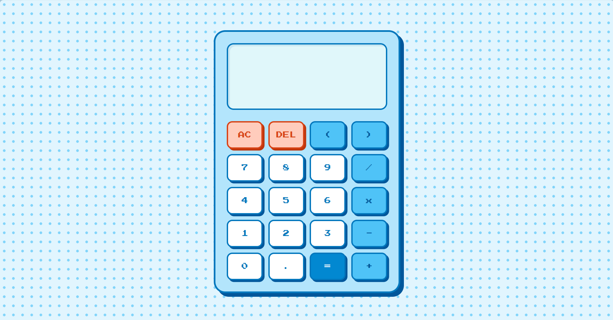

# 🤖 Pixel Art Calculator
**เครื่องคิดเลขย้อนยุคสไตล์ Pixel Art พร้อมระบบคำนวณตามหลักคณิตศาสตร์**

---

## ✨ คุณสมบัติของระบบ
* **ระบบคำนวณ:** รองรับ PEMDAS (คูณ/หาร ก่อน บวก/ลบ) และวงเล็บ
* **UI:** สไตล์ Retro Pixel Art สบายตา
* **Data:** บันทึกประวัติด้วย LocalStorage (ข้อมูลไม่หาย)

---

## 🛠️ 1. วิธีการติดตั้ง (Installation)

เนื่องจากเป็น Web Application แบบ Client-side จึงไม่ต้องติดตั้งโปรแกรมเสริมใดๆ

1.  **ดาวน์โหลด Source Code:**
    * Clone ผ่าน Git:

        [https://github.com/jejesarinrat/pixel-calculator.git](https://github.com/jejesarinrat/pixel-calculator.git)

    * หรือกดปุ่ม **Code** > **Download ZIP** แล้วแตกไฟล์

2.  **เข้าสู่โฟลเดอร์งาน:**
    * cd pixel-calculator

---

## ▶️ 2. วิธีรันโปรแกรม (How to Run)

สามารถเปิดใช้งานได้ 2 วิธี:

* **วิธีที่ 1 (แนะนำ):** ดับเบิ้ลคลิกไฟล์ **`index.html`** เพื่อเปิดผ่าน Web Browser (Chrome, Edge, Safari) ได้ทันที
* **วิธีที่ 2 (สำหรับ VS Code):** คลิกขวาที่ไฟล์ `index.html` แล้วเลือก **Open with Live Server**

---

## 📂 3. โครงสร้างโค้ด (Code Structure)

ไฟล์ในโปรเจกต์ถูกจัดระเบียบเพื่อให้เข้าใจง่าย ดังนี้:

* **`index.html`**
    * ไฟล์หลักสำหรับแสดงผลหน้าเว็บ
    * ประกอบด้วยโครงสร้าง HTML ของหน้าจอแสดงผลและปุ่มกด (Grid Layout)
* **`style.css`**
    * ไฟล์กำหนดรูปแบบการแสดงผล (Styling)
    * จัดการธีม Pixel Art, สี, ฟอนต์, และ Effect เงาของปุ่มกด
* **`script.js`**
    * ไฟล์ควบคุมการทำงานหลัก (Core Logic)
    * ฟังก์ชัน `calculate()`: ประมวลผลนิพจน์ทางคณิตศาสตร์และจัดการ Error
    * ฟังก์ชัน `localStorage`: จัดการการบันทึกและอ่านประวัติการคำนวณ

---

## 🌐 ทดลองใช้งานออนไลน์ (Live Demo)
สามารถเข้าใช้งานได้ที่: [https://jejesarinrat.github.io/pixel-calculator/](https://jejesarinrat.github.io/pixel-calculator/)